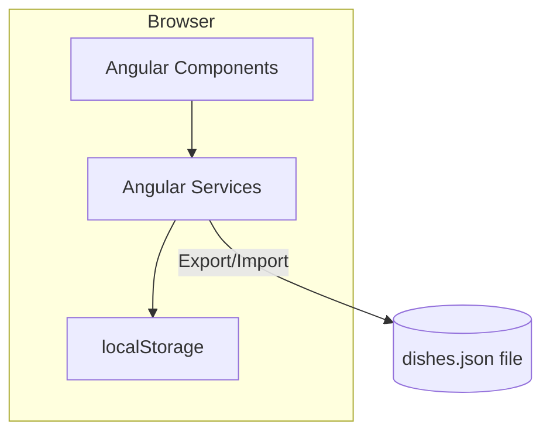

# Design Document: Menu Planner

## Overview

The Menu Planner is a lightweight Angular single-page application for managing a personal collection of dishes and generating consolidated shopping lists. It runs entirely in the browser with no backend server — data is persisted in `localStorage` for session continuity, and the user can export/import their collection as a JSON file for backup and portability.

The MVP prioritizes simplicity — a single-user application with no authentication, no server, and minimal dependencies beyond Angular itself.

## Architecture



### Key Architectural Decisions

| Decision | Choice | Rationale |
|----------|--------|-----------|
| Framework | Angular | User familiarity, strong typing with TypeScript, built-in routing and forms |
| Backend | None | MVP doesn't need a server; localStorage is sufficient for single-user persistence |
| Storage | localStorage | Zero setup, instant reads/writes, no server needed |
| Data portability | JSON export/import | Allows backup/restore and satisfies the "JSON file" requirement without a backend |
| Styling | Angular Material or plain CSS | Responsive, mobile-first for supermarket use case |
| State management | Angular services with BehaviorSubjects | Simple reactive state, no need for NgRx at MVP scale |

### Application Flow

1. On startup, the app loads the dish collection from `localStorage`
2. User interacts with Angular components (add/edit/remove dishes, select for shopping list)
3. Services handle business logic (validation, consolidation) and persist changes to `localStorage`
4. User can export their collection as a downloadable JSON file or import from a JSON file

## Components and Interfaces

### Angular Module Structure

```
src/
├── app/
│   ├── app.component.ts          # Root component with layout
│   ├── app.routes.ts             # Route configuration
│   ├── models/
│   │   ├── dish.model.ts         # Dish and Ingredient interfaces
│   │   └── shopping-list.model.ts # ShoppingListItem interface
│   ├── services/
│   │   ├── dish.service.ts       # Dish CRUD operations
│   │   ├── shopping-list.service.ts # Shopping list generation
│   │   ├── storage.service.ts    # localStorage read/write + JSON export/import
│   │   └── validation.service.ts # Input validation
│   ├── components/
│   │   ├── dish-list/            # Displays all dishes, handles selection
│   │   ├── dish-form/            # Add/edit dish form with ingredient management
│   │   ├── shopping-list/        # Displays consolidated shopping list
│   │   └── import-export/        # JSON file import/export controls
│   └── pipes/
│       └── sort-alphabetical.pipe.ts # Alphabetical sorting pipe
```

### Services

#### 1. DishService (`services/dish.service.ts`)
Manages the dish collection state:
- `dishes$: Observable<Dish[]>` — reactive stream of all dishes
- `getDishes(): Dish[]` — returns current dish collection
- `addDish(dish: Dish): Dish` — validates and adds a dish, returns the new dish with generated ID
- `updateDish(id: string, dish: Partial<Dish>): Dish` — validates and updates an existing dish
- `removeDish(id: string): void` — deletes a dish by ID

#### 2. ShoppingListService (`services/shopping-list.service.ts`)
Handles shopping list generation:
- `generateShoppingList(dishIds: string[]): ShoppingListItem[]` — consolidates ingredients from selected dishes
- `selectedDishIds$: Observable<Set<string>>` — reactive stream of selected dish IDs
- `toggleDishSelection(id: string): void` — toggles a dish's selection state
- `clearSelection(): void` — deselects all dishes

#### 3. StorageService (`services/storage.service.ts`)
Handles persistence:
- `loadCollection(): DishCollection` — reads and parses from `localStorage`, returns empty collection on error
- `saveCollection(data: DishCollection): void` — serializes and writes to `localStorage`
- `exportToJson(): void` — triggers a JSON file download of the current collection
- `importFromJson(file: File): Promise<DishCollection>` — reads and parses an uploaded JSON file

#### 4. ValidationService (`services/validation.service.ts`)
Input validation:
- `validateDish(dish: Dish): ValidationResult` — ensures non-empty name and at least one valid ingredient
- `validateIngredient(ingredient: Ingredient): ValidationResult` — ensures non-empty name and quantity > 0

### Components

#### 1. DishListComponent
- Displays all dishes in a scrollable list
- Checkbox or toggle for selecting dishes
- Edit/delete action buttons per dish
- Visual indicator for selected dishes

#### 2. DishFormComponent
- Reactive form for dish name
- Dynamic FormArray for ingredients (name, quantity, unit)
- Add/remove ingredient buttons
- Validation feedback displayed inline

#### 3. ShoppingListComponent
- Displays consolidated, alphabetically sorted shopping list
- Checkbox per item for checking off while shopping
- Print button that triggers `window.print()`
- Mobile-optimized layout

#### 4. ImportExportComponent
- Export button to download `dishes.json`
- Import button with file picker to upload a JSON file
- Warning display if imported file is invalid

### Interface Contracts

#### Dish Model
```typescript
interface Ingredient {
  name: string;
  quantity: number;
  unit: string;
}

interface Dish {
  id: string;       // UUID
  name: string;
  ingredients: Ingredient[];
}

interface DishCollection {
  dishes: Dish[];
}
```

#### Shopping List Item
```typescript
interface ShoppingListItem {
  name: string;
  quantity: number;
  unit: string;
  checked: boolean;
}
```

#### Validation Result
```typescript
interface ValidationResult {
  valid: boolean;
  errors: string[];
}
```

## Data Models

### Storage Schema (localStorage key: `menu-planner-dishes`)

```json
{
  "dishes": [
    {
      "id": "550e8400-e29b-41d4-a716-446655440000",
      "name": "Spaghetti Bolognese",
      "ingredients": [
        { "name": "spaghetti", "quantity": 500, "unit": "g" },
        { "name": "ground beef", "quantity": 400, "unit": "g" },
        { "name": "tomato sauce", "quantity": 1, "unit": "jar" }
      ]
    }
  ]
}
```

### Shopping List Generation Logic

The consolidation algorithm:
1. Collect all ingredients from selected dishes
2. Group by normalized ingredient name (case-insensitive, trimmed)
3. For ingredients with the same name and unit: sum quantities
4. For ingredients with the same name but different units: keep as separate entries
5. Sort the final list alphabetically by ingredient name

### Ingredient Name Normalization

To combine ingredients correctly:
- Trim whitespace
- Convert to lowercase for comparison
- Display uses the original casing from the first occurrence


## Correctness Properties

*A property is a characteristic or behavior that should hold true across all valid executions of a system — essentially, a formal statement about what the system should do. Properties serve as the bridge between human-readable specifications and machine-verifiable correctness guarantees.*

### Property 1: Dish add/retrieve round-trip

*For any* valid dish (non-empty name, at least one valid ingredient), adding it to the dish collection and then retrieving the collection should yield a collection containing that dish with identical name and ingredients.

**Validates: Requirements 1.2, 2.1**

### Property 2: Dish and ingredient edit preserves changes

*For any* existing dish in the collection and any valid replacement data (new name, new ingredients), updating the dish and then retrieving it should yield the dish with the new name and new ingredients exactly as provided. Similarly, for any ingredient within a dish, editing its name, quantity, or unit should be reflected when the dish is retrieved.

**Validates: Requirements 1.3, 2.3**

### Property 3: Dish removal reduces collection

*For any* dish collection containing at least one dish, removing a dish by its ID should result in a collection that no longer contains that dish and has exactly one fewer dish than before.

**Validates: Requirements 1.4**

### Property 4: Ingredient removal reduces dish ingredients

*For any* dish with more than one ingredient, removing an ingredient should result in the dish having exactly one fewer ingredient and not containing the removed ingredient.

**Validates: Requirements 2.4**

### Property 5: Validation rejects invalid dishes and ingredients

*For any* dish with an empty/whitespace-only name OR zero ingredients, validation shall reject it. *For any* ingredient with an empty/whitespace-only name OR quantity <= 0, validation shall reject it. *For any* dish with a non-empty name and at least one valid ingredient, validation shall accept it.

**Validates: Requirements 1.5, 2.2**

### Property 6: Shopping list consolidation correctness

*For any* set of selected dishes, the generated shopping list shall contain every ingredient name present across all selected dishes, and for ingredients sharing the same normalized name and unit, the shopping list quantity shall equal the sum of the individual quantities.

**Validates: Requirements 4.1, 4.2**

### Property 7: Shopping list alphabetical ordering

*For any* generated shopping list with more than one item, the items shall be sorted in case-insensitive alphabetical order by ingredient name.

**Validates: Requirements 4.3**

### Property 8: Persistence round-trip

*For any* valid dish collection, saving it to localStorage and then loading from localStorage should produce an equivalent dish collection with all dishes and ingredients preserved.

**Validates: Requirements 6.1, 6.2**

### Property 9: Invalid storage yields empty collection

*For any* string that is not valid JSON (including empty string, random bytes, malformed brackets), attempting to load the dish collection from localStorage containing that string should return an empty dish collection without throwing an unhandled error.

**Validates: Requirements 6.3**

## Error Handling

| Scenario | Behavior |
|----------|----------|
| localStorage empty on startup | Create empty collection, continue normally |
| localStorage contains invalid JSON | Start with empty collection, display warning toast/banner |
| localStorage write failure (quota exceeded) | Display error message to user, data remains in memory |
| Invalid dish submitted (empty name) | Show inline validation error, prevent save |
| Invalid ingredient (quantity <= 0) | Show inline validation error, prevent save |
| Dish ID not found on edit/delete | Log warning, no-op (defensive coding) |
| No dishes selected for shopping list | Display message "Select at least one dish" |
| Imported JSON file is invalid | Display error message, do not overwrite existing collection |
| Imported JSON file has wrong structure | Display error with details, reject import |

### Error Display Strategy

- **Validation errors**: Inline beneath form fields using Angular reactive form validators
- **System errors** (storage failures): Toast notification or banner at the top of the page
- **Import errors**: Alert within the import/export component area

## Testing Strategy

### Property-Based Testing

**Library:** [fast-check](https://github.com/dubzzz/fast-check) (TypeScript/JavaScript property-based testing library)

**Test runner:** Jasmine (Angular's default) or Jest

**Configuration:** Minimum 100 iterations per property test.

**Tag format:** Each property test is tagged with a comment:
```
// Feature: menu-planner, Property {N}: {property text}
```

Property tests cover:
- Dish CRUD round-trips (Properties 1–4)
- Validation logic (Property 5)
- Shopping list generation and consolidation (Properties 6–7)
- localStorage persistence round-trip (Properties 8–9)

### Unit Tests

Example-based unit tests cover:
- Dish selection/deselection state management (Requirements 3.1–3.4)
- Empty selection edge case (Requirement 4.4)
- Shopping list check-off toggle behavior (Requirement 5.3)
- Specific known consolidation scenarios (e.g., "2 eggs + 3 eggs = 5 eggs")
- JSON export produces valid downloadable file
- JSON import correctly loads a known file

### Component Tests

Angular TestBed-based tests:
- DishListComponent renders all dishes
- DishFormComponent validates input and emits correct events
- ShoppingListComponent displays items and handles check-off
- ImportExportComponent handles file upload/download

### Manual/Visual Testing

- Mobile responsiveness (Requirement 5.1)
- Print stylesheet layout (Requirement 5.2)
- Visual distinction of checked-off items (Requirement 5.4)
- Visual indication of selected dishes (Requirement 3.4)
